<div align="center">


<a href="https://readme-typing-svg.demolab.com">

</a>

<br/>


<br/><br/>

<a href="mailto:yashpalkar16@gmail.com">

</a>
<a href="https://www.linkedin.com/in/palkar-y-11734a262">

</a>
<a href="https://github.com/yashpalkar16/">

</a>

<br/>


</div>

---

## ABOUT

I am a **Software Engineer and AI/ML Engineer** focused on designing, developing, and deploying scalable software systems that solve complex engineering and operational problems.

My engineering experience spans **backend development, full-stack systems, artificial intelligence, machine learning, databases, cloud infrastructure, security, and data-intensive platforms**. I enjoy working at the intersection of software engineering and applied AI, with a strong emphasis on building systems that are reliable, maintainable, measurable, and production-ready.

Currently, I work on engineering systems involving **optimization, vulnerability intelligence, large-scale CVE correlation, software analysis, and automated security workflows**.

### Engineering Focus

* Backend & distributed application development
* AI / ML systems and applied intelligence
* Full-stack product engineering
* Data-intensive software systems
* Security engineering & vulnerability intelligence
* Cloud-native development and deployment
* Database architecture and optimization
* Algorithmic problem solving
* Production automation and developer tooling

### Open To

`Software Engineering` · `Backend Engineering` · `AI/ML Engineering` · `Full Stack Engineering` · `Product Engineering` · `Applied AI` · `Open Source`

---

## TECH STACK

### Languages

<p>

</p>

### Frontend

<p>

</p>

### Backend & Databases

<p>

</p>

### Cloud, DevOps & Tooling

<p>

</p>

### AI / Data

<p>

</p>

`Pandas` · `NumPy` · `Scikit-learn` · `Data Visualization` · `Statistical Analysis` · `Hugging Face`

---

## AI / ML EXPERTISE

| Domain             | Proficiency | Details                                                                              |
| ------------------ | ----------- | ------------------------------------------------------------------------------------ |
| Machine Learning   | Advanced    | Python-based ML workflows, Scikit-learn, statistical analysis and model evaluation   |
| Deep Learning      | Advanced    | TensorFlow-based development and applied neural network workflows                    |
| Generative AI      | Advanced    | LLM-based applications, instruction-tuned models, prompting and AI pipelines         |
| NLP                | Advanced    | Language-model workflows and automated text generation                               |
| Audio Intelligence | Advanced    | Audio embeddings, feature extraction and LLM-based music caption generation          |
| Data Science       | Advanced    | Pandas, NumPy, statistical analysis and data visualization                           |
| Applied AI         | Advanced    | Translating AI capabilities into practical software products and engineering systems |
| AI Pipelines       | Advanced    | End-to-end feature extraction, inference, storage and evaluation workflows           |

---

## FEATURED PROJECTS

<details>
<summary><strong>01 · Network Topology Designer & Analyzer</strong></summary>

### Network Topology Designer & Analyzer

Enterprise-style network analysis platform designed to model complex network infrastructures as graph structures and perform real-time topology analysis.

| Dimension       | Details                                                           |
| --------------- | ----------------------------------------------------------------- |
| **Stack**       | Spring Boot · React · PostgreSQL · Docker                         |
| **Scale**       | Multi-tenant network topology management                          |
| **Performance** | BFS · DFS · Dijkstra's Algorithm                                  |
| **Security**    | Spring Security · JWT · Role-Based Authorization                  |
| **Impact**      | Real-time topology modeling, routing analysis and fault isolation |
| **Repository**  | [GitHub](https://github.com)                                      |

### Engineering Scope

* Modeled complex network infrastructure as graph structures.
* Implemented shortest-path routing using Dijkstra's Algorithm.
* Implemented connectivity verification and cycle detection using BFS and DFS.
* Built fault-isolation capabilities for network troubleshooting.
* Developed an interactive topology visualization engine.
* Implemented role-based authentication and authorization.
* Designed PostgreSQL-backed multi-tenant topology management.
* Containerized the application using Docker.
* Automated database schema management using JPA/Hibernate.

</details>

<details>
<summary><strong>02 · CVE Correlation Engine</strong></summary>

### CVE Correlation Engine

Large-scale vulnerability correlation system designed to automatically identify software vulnerabilities by mapping installed applications against the National Vulnerability Database.

| Dimension       | Details                                                         |
| --------------- | --------------------------------------------------------------- |
| **Stack**       | Python · PostgreSQL · NVD · CPE                                 |
| **Scale**       | 300K+ CVEs                                                      |
| **Performance** | Automated vulnerability correlation pipeline                    |
| **Security**    | Vulnerability intelligence and software applicability analysis  |
| **Impact**      | Automated CVE scanning and correlation across operating systems |
| **Repository**  | [GitHub](https://github.com)                                    |

### Engineering Scope

* Built a CVE correlation pipeline processing more than 300,000 CVEs.
* Mapped installed software applications against NVD vulnerability data.
* Developed automated vulnerability scanning workflows.
* Designed PostgreSQL-backed vulnerability intelligence processing.
* Supported software vulnerability correlation across operating systems.
* Focused on reliable applicability and correlation of vulnerability data.

</details>

<details>
<summary><strong>03 · Replenishment-at-Sea Planning System</strong></summary>

### Replenishment-at-Sea Planning System

Optimization-based planning system developed for complex naval logistics scenarios.

| Dimension       | Details                                                  |
| --------------- | -------------------------------------------------------- |
| **Stack**       | Optimization · Software Engineering · Data Processing    |
| **Scale**       | Multi-depot naval logistics scenarios                    |
| **Performance** | Optimization-based scheduling                            |
| **Security**    | Operational planning system                              |
| **Impact**      | Optimal shuttle schedules and operational cost reduction |
| **Repository**  | [GitHub](https://github.com)                             |

### Engineering Scope

* Developed an optimization-based RAS planning system.
* Generated optimal shuttle schedules.
* Enabled feasibility analysis for complex multi-depot scenarios.
* Addressed operational constraints within naval logistics planning.
* Designed the system around practical optimization and decision-support requirements.

</details>

<details>
<summary><strong>04 · Network Packet Sniffer</strong></summary>

### Network Packet Sniffer

Java-based packet inspection and traffic analysis application capable of capturing, filtering and inspecting network traffic at packet level.

| Dimension       | Details                                                   |
| --------------- | --------------------------------------------------------- |
| **Stack**       | Java · JSP · Servlets · JPCAP                             |
| **Scale**       | Real-time network traffic                                 |
| **Performance** | Optimized packet capture and session logging              |
| **Security**    | Packet-level traffic inspection                           |
| **Impact**      | Network monitoring, protocol analysis and troubleshooting |
| **Repository**  | [GitHub](https://github.com)                              |

### Engineering Scope

* Captured and filtered real-time network traffic.
* Inspected network packets at protocol level.
* Built JSP/Servlet dashboards for traffic visualization.
* Implemented TCP, UDP and HTTP protocol parsing.
* Added traffic statistics and packet-level analysis.
* Optimized packet capture and session logging.

</details>

<details>
<summary><strong>05 · LLM-Based Music Captioning</strong></summary>

### LLM-Based Music Captioning

AI-powered music captioning system using audio embeddings and instruction-tuned language models to generate descriptive captions.

| Dimension       | Details                                             |
| --------------- | --------------------------------------------------- |
| **Stack**       | Python · Hugging Face · Audio Embeddings · Database |
| **Scale**       | End-to-end captioning pipeline                      |
| **Performance** | Automated caption generation and evaluation         |
| **Security**    | Structured metadata and embedding storage           |
| **Impact**      | Automated semantic descriptions of music            |
| **Repository**  | [GitHub](https://github.com)                        |

### Engineering Scope

* Built an LLM-based music captioning pipeline.
* Used audio embeddings for semantic feature extraction.
* Integrated instruction-tuned language models.
* Implemented automated caption generation.
* Designed database workflows for audio metadata and embeddings.
* Evaluated genre, mood and instrumentation descriptors.
* Combined automated and manual evaluation methods.

</details>

<details>
<summary><strong>06 · Course Management Portal</strong></summary>

### Course Management Portal

Full-stack course management platform built around a React frontend and Django REST backend.

| Dimension       | Details                                               |
| --------------- | ----------------------------------------------------- |
| **Stack**       | React · Django · REST API · PostgreSQL · Docker · Git |
| **Scale**       | Course, instructor and enrollment management          |
| **Performance** | REST-based application architecture                   |
| **Security**    | Backend API architecture                              |
| **Impact**      | Centralized academic course management                |
| **Repository**  | [GitHub](https://github.com)                          |

### Engineering Scope

* Built a React + Django REST application.
* Designed PostgreSQL schemas for courses, instructors and enrollments.
* Developed REST APIs for application workflows.
* Containerized the application using Docker.
* Maintained source control and development workflows using Git.

</details>

---

## EXPERIENCE

### Sr. Project Technical Assistant

**Technocraft Center for Applied Artificial Intelligence — IIT Bombay**
`December 2024 – Present` · Powai, Mumbai

Engineering systems across optimization, artificial intelligence, vulnerability intelligence and large-scale software analysis.

**Scope**

* Developed optimization-based planning systems for complex naval logistics scenarios.
* Built a CVE Correlation Engine for automated software vulnerability detection.
* Designed PostgreSQL pipelines processing **300K+ CVEs**.
* Developed automated mapping between installed applications and NVD vulnerability intelligence.
* Worked on vulnerability scanning and correlation across operating systems.
* Applied software engineering principles to large-scale data and security workflows.

**Core Skills**

`Python` `PostgreSQL` `CVE` `NVD` `CPE` `AI/ML` `Optimization` `Security Engineering` `Data Processing`

---

## ACHIEVEMENTS

<div align="center">

| Recognition                              | Details                                                                                                       |
| ---------------------------------------- | ------------------------------------------------------------------------------------------------------------- |
| **300K+ CVE Processing**                 | Developed a PostgreSQL-backed CVE correlation pipeline processing more than 300,000 CVEs                      |
| **Indian Navy RAS Planning**             | Developed an optimization-based Replenishment-at-Sea planning system for complex naval logistics              |
| **Automated Vulnerability Intelligence** | Built automated software-to-vulnerability correlation workflows using NVD data                                |
| **Enterprise Network Engineering**       | Designed a multi-tenant network topology analysis platform with graph algorithms and role-based security      |
| **Applied AI Engineering**               | Developed an LLM-based music captioning pipeline using audio embeddings and instruction-tuned language models |

</div>

---

## CERTIFICATIONS

### IBM


### Tata Group


---

## CODING PROFILES

<div align="center">

<a href="https://leetcode.com">

</a>

<a href="https://www.geeksforgeeks.org">

</a>

<a href="https://www.hackerrank.com">

</a>

<a href="https://www.codechef.com">

</a>

</div>

---

## GITHUB ANALYTICS

<div align="center">




</div>

<div align="center">



</div>

---

## GITHUB TROPHIES

<div align="center">


</div>

---

## CONTRIBUTION ACTIVITY

<div align="center">


</div>

---

## CONTRIBUTION SNAKE

<div align="center">

<picture>
  <source
    media="(prefers-color-scheme: dark)"
    srcset="https://raw.githubusercontent.com/yashpalkar16/yashpalkar16/refs/heads/output/github-contribution-grid-snake-dark.svg?token=GHSAT0AAAAAAEGHWMDUQ4RGUIAFA6WBIVUY2U5L42A"
  />
  <source
    media="(prefers-color-scheme: light)"
    srcset="https://raw.githubusercontent.com/yashpalkar16/yashpalkar16/refs/heads/output/github-contribution-grid-snake.svg?token=GHSAT0AAAAAAEGHWMDUG6AXQSBORHDFRYUU2U5L63Q"
  />
  
</picture>

</div>

---

## CURRENT FOCUS

```yaml
Learning:
  - Advanced AI/ML systems
  - Large-scale software engineering
  - Cloud-native architectures
  - Security engineering
  - Optimization algorithms

Building:
  - Production-grade software systems
  - AI-powered engineering workflows
  - Vulnerability intelligence systems
  - Scalable backend platforms

Exploring:
  - Generative AI
  - LLM applications
  - Applied machine learning
  - Distributed systems
  - Developer infrastructure

Open To:
  - Software Engineering
  - Backend Engineering
  - AI/ML Engineering
  - Full Stack Engineering
  - Product Engineering
  - Applied AI
  - Open Source
```

---

## CONNECT

<div align="center">

<a href="mailto:yashpalkar16@gmail.com">

</a>

<a href="https://www.linkedin.com/in/palkar-y-11734a262/">

</a>

<a href="https://github.com/yashpalkar16/">

</a>

<a href="mailto:yashpalkar16@gmail.com">

</a>

</div>

---

<div align="center">


### *“Build systems that turn complexity into clarity.”*

</div>
